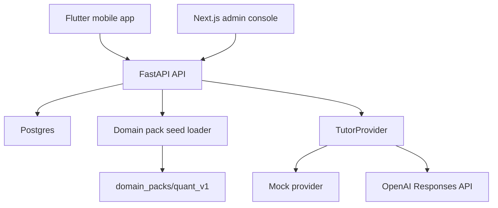

# AI Learning OS Architecture

## Product Boundary

AI Learning OS is a mobile-first learning system. It does not execute quant backtests, run strategies, manage portfolios, place trades, or read results from an external quant system in the MVP.

The product exists to help a learner use fragmented time better:

- pick the next small learning step
- learn one concept or skill
- answer a question or explain the idea
- record mastery evidence
- schedule review
- maintain long-term learner state

## Core Learning OS

The reusable core is domain-neutral:

- `DomainPack`: a pluggable learning domain such as quant, math, programming, or English
- `SkillNode`: a concept or ability the learner can develop
- `SkillEdge`: prerequisite relationships between skills
- `LearningSession`: one short learning interaction
- `MasteryEvidence`: quiz, explanation, transfer, review, or micro-project evidence
- `LearnerSkillState`: mastery, confidence, last seen time, review due time
- `TutorProvider`: a unified interface for Mock or OpenAI tutor responses

## First Domain Pack

`domain_packs/quant_v1/domain.json` is the first validation pack. It contains quant concepts only as learning content. `backtest_concepts` teaches what backtesting means, but the app has no backtest execution feature.

## Data Flow

## MVP Learning Loop

1. Mobile app calls `GET /api/v1/review/next`.
2. Backend returns due review items or new skills from the active Domain Pack.
3. User opens a short learning session.
4. Mobile app creates `LearningSession`.
5. User answers an explanation/review prompt.
6. Mobile app posts `MasteryEvidence`.
7. Backend updates `LearnerSkillState`.
8. Admin console can inspect the state and evidence.

## Extension Rules

- Add new domains by adding a new `domain_packs/<slug>/domain.json`.
- Do not add domain-specific columns to core learner tables.
- Keep external practice systems separate unless a future integration is explicitly designed.
- Treat OpenAI as one tutor provider, not as the source of truth for learner state.

